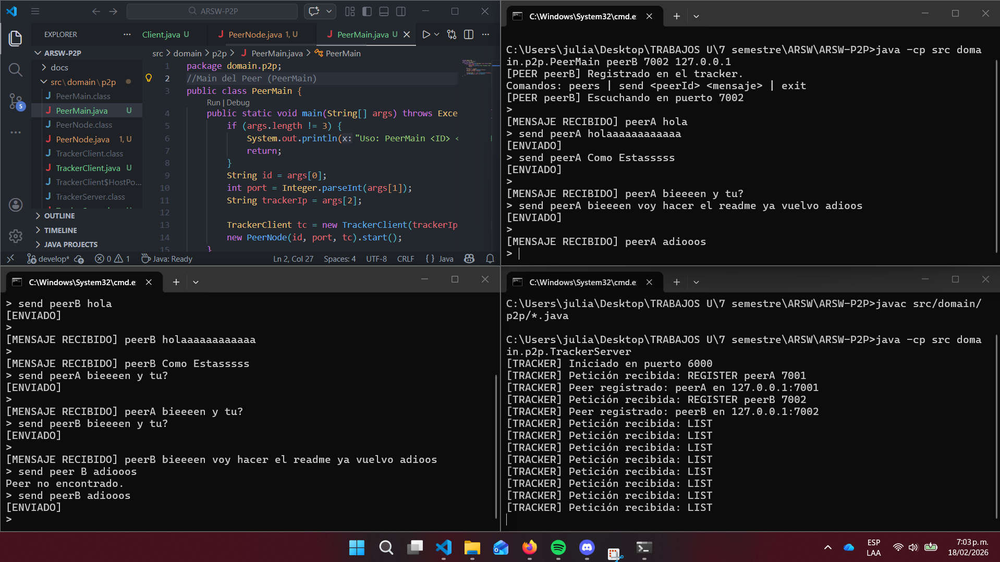

# ARSW-P2P

# Escuela Colombiana de Ingeniería – Arquitecturas de Software

Descripción
---
Proyecto de ejemplo que implementa un sistema P2P simple con un tracker central y peers. 
Permite levantar un servidor tracker y varios peers que se registran y pueden intercambiar información 

- **Lenguaje:** Java

Estructura principal
---

- `src/domain/p2p/` - implementación principal P2P.
    - `PeerMain.java` - clase main que inicia un peer
    - `PeerNode.java` - representación de un peer y lógica de nodo
    - `TrackerClient.java` - cliente que comunica con el tracker
    - `TrackerServer.java` - servidor tracker que gestiona registros de peers


## Requisitos
- Java JDK 11+ instalado y en `PATH`.
- (Opcional) IDE como IntelliJ IDEA o Eclipse para abrir el proyecto.

Instalación y compilación
---
1. Clonar el repositorio:
     ```bash
     git clone <URL_DEL_REPOSITORIO>
     cd ARSW-P2P
     ```
2. Compilar las clases Java (desde la raíz del proyecto):
     ```bash
     javac src/domain/p2p/*.java
     ```

Ejecución
---
Abrir varias terminales (3 o mas) para ejecutar el tracker y varios peers.

- Tracker (terminal 1):
    ```bash
    java -cp bin domain.p2p.TrackerServer
    ```

- Peer A (terminal 2) — ejemplo de ejecución:
    ```bash
    java -cp bin domain.p2p.PeerMain peerA 7001 127.0.0.1
    ```

- Peer B (terminal 3) — ejemplo de ejecución:
    ```bash
    java -cp bin domain.p2p.PeerMain peerB 7002 127.0.0.1
    ```

Para seguir añadiendo peer basta con ejecutarlo y añadir a el siguiente numero un numero x: 700x 


Prueba rápida
---
1. Inicie primero el tracker.
2. Inicie uno o más peers usando nombres distintos y puertos distintos.
3. Observe en la salida del tracker los registros de peers conectados.


## Prueba Ejecucion en el cmd
---


## 🙋 Autor

---
- **Julian Camilo Lopez Barrero** - [JulianLopez11](https://github.com/JulianLopez11)

